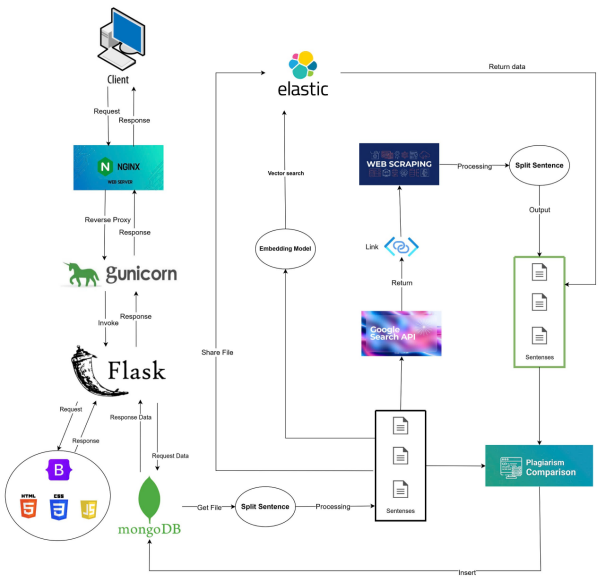
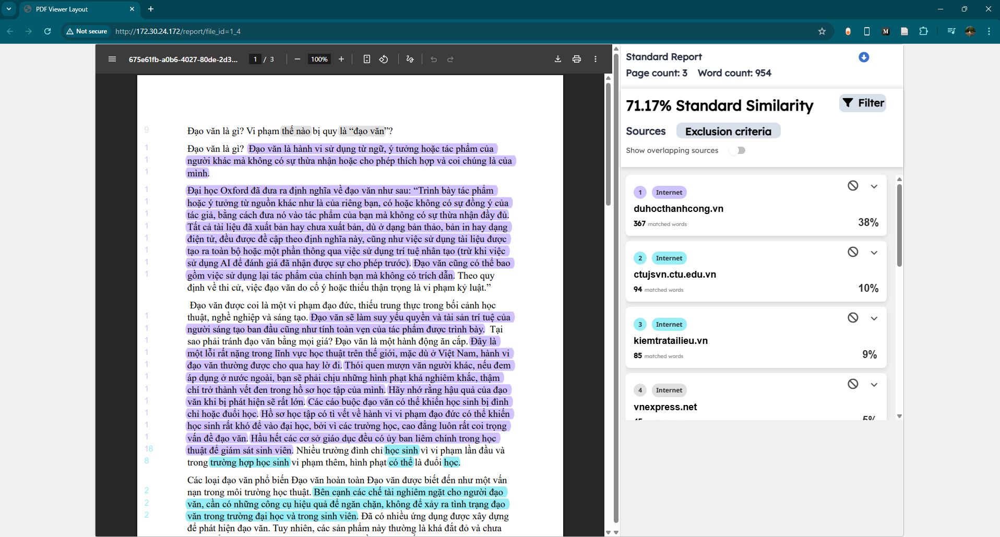
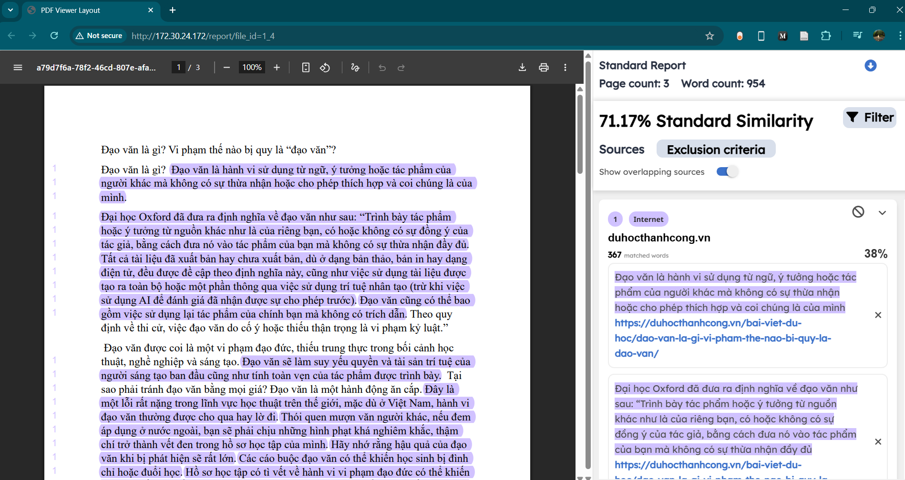
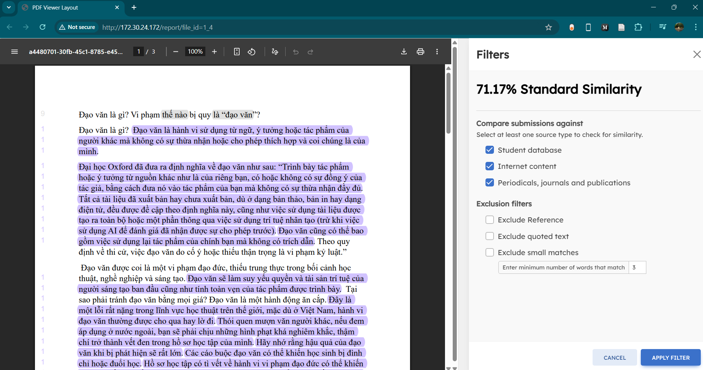

# Plagiarism Detection System

Plagiarism detection system based on internal data sources and the Internet

## 🚀 Features

- ✅ Build a system to upload, validate, and store documents on MongoDB
- ✅ Text preprocessing: cleaning, sentence splitting, keeping Vietnamese formatting
- ✅ Embedding text sentences into vectors with Sentence Transformer model
- ✅ Find matching content in Elasticsearch using vector search method quickly
- ✅ Search for matching sources on the internet with Google customserch API, extract content according to the searched URLs and show the matching sentences
- ✅ Match rate statistics, highlight matching sources on pdf file
- ✅ Deploy the system on nginx web server and ubuntu server operating system

## Architecture

## Demo

### Stander report:

### Report with 1 source:

### Apply Filters:

